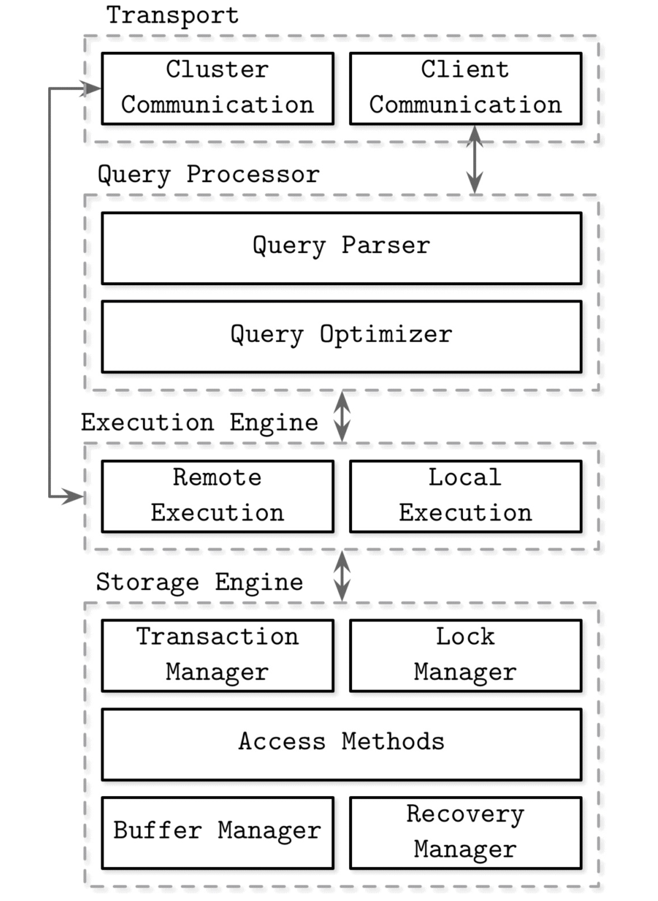

## Database Internals Ch 1

#### Intro

Modular componenets
* A transport layer for accepting request
* Query processor
* Executor engine
* Storage engine

Storage engine 
* manages data on disk
* provides CRUD
* designed to have long term memory
* Key and value are byte sequences

Example - 
* InnoDB, RocksDB, 9 others for mySQL
* Postgres?
* WiredTiger for Mongo
* LevelDB

Database system utilises storage engine to provide 
* Schema 
* Query language
* Indexing
* Transactions
* Etc

——————

### Table of contents

1. Architecture
2. Memory vs Disk based DBMS
3. Column vs Row based DBMS
4. Data and Index files
5. Buffering immutability and ordering

_Not just couple of groups can represent taxonomy of DBMS_

One classification (based on querying support)
* OLTP -short, user faced
* OLAP
* Hybrid

One More:
* Key-value
* Relational
* Document-oriented
* Graph

#### Architecture

DBMS use client server/model where DB nodes are servers, users, the applications are the clients and communicate via a transportation protocol.

Transport subsystems allow clients to communicate with DB servers, as well as communicate with other nodes in DB cluster.

Requests come as in the format of queries through transport layer which will be parsed by a query processor, which parses, interprets, and validates it. access control checks are performed, as they can be done fully only after the query is interpreted.

The parsed query is now parsed to query optimizer.

Optimization happens on variables 
* Remove impossible and redundant parts
* Index ordering
* Cardinality estimation
* Intersection size
* Choosing access methods
* <.. more

The query presented in the form of an execution plan (or query plan). Since the same query can be satisfied using different execution plans that can vary in efficiency, the optimizer picks the best available plan.

The query execution plan is passed on to execution engine. Which does local and remote executions (write to and read data from other nodes in cluster)

On a particular node's local, queries are executed on storage engine. This component has these responsibilities:
* Transaction (Schedules transactions and makes sure data is not logically inconsistent)
* Locking (Locks the involved objects during transaction so that data is not physically inconsistent)
* Access methods (Storing/organizing data on disk. Heap files. B trees. LSM trees)
* Buffer manager (Caching data pages in memory)
* Recovery manager (Incase of failures restores the system by maintaining of operations)

Note: Together, Transaction and locking, provide logical and physical consistency of data, while also ensuring efficiency 

Different storage structures are chosen for access methods based on usecases like 
* single row search
* range searching
* Read heavy
* Write heavy

 
  

#### Memory vs Disk

> Storage based classification

Both type of databases use main memory and disk but differently. 
* Memory based DBs use memory as storage and disk for recovery and logging
* Disk based DBs use Disk to organize data and memory as a cache or temp storage

#### Column vs Row

> Layout based translations

#### Data files and Indexes

#### Buffering and Immutability

Explore
* Column vs wide column
