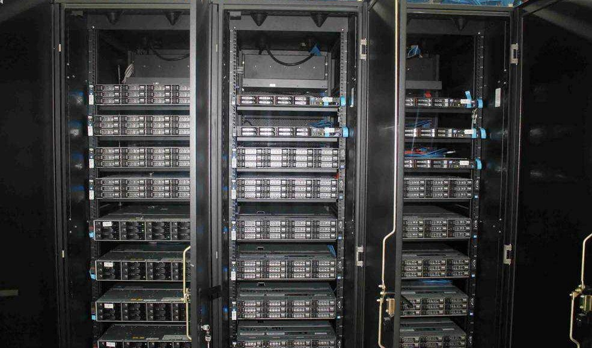
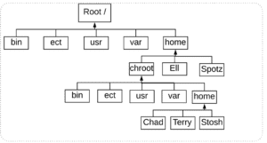
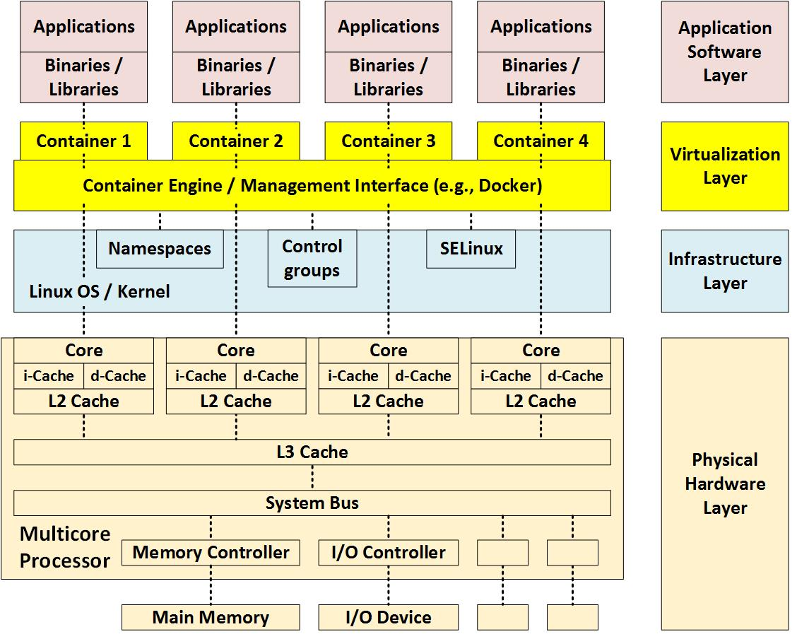
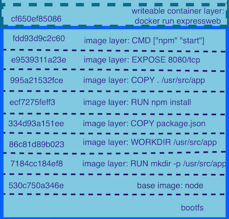

# Containers

Take aways: 

How we arrived at containers is not a single path journey.

> Container is a concept to achieve virtualization. To run isolated processes.

***

__Computers in 1950s__

Intel 4004 in 1970 0.06 MIPS and 4bit processor

__Now__

Normal 177,000 MIPS

> Computing power and memory has increased (Exploded)

Story of how computers became small and powerful.

Requirements of computation. Solutions

.

.

.

.

.

.

.

.

.

.
.

.

.

.

.

### Cloud computing

* PaaS 
* IaaS 
* Faas 
* SaaS 

### Why Virtualization?

* Use the resources effectively.
* Resource management.
* Software with different dependencies.
* Run untrusted software.
* Don't disturb other processes.
* Scaling independently and runtime limitations.
* Fault tolerence.

Isolations

* Networking
* Storage
* Computation

.

.

.

.

.
.

.

.

.

.
.

.

.

.

.

## Backstory

Why Linux/Unix - it's open sourced

Chroot in introduced 4.2BSD, which is used to change the root directory of the user.

> Unix philosophy - Evertything is a file 

[Unix Philosophy](https://homepage.cs.uri.edu/~thenry/resources/unix_art/ch01s06.html)

Linux Root directory

[File Hierarchy Standard](https://en.wikipedia.org/wiki/Filesystem_Hierarchy_Standard)

[User spaces](https://en.wikipedia.org/wiki/User_space)

> How can we use `chroot`?

Linux /proc folder

[Linux process](https://www.tldp.org/LDP/tlk/kernel/processes.html)

> chroot is not meant to do that. No one knows too.

___

FreeBSD Jail addressing security issues. In Unix root is the super user and can do anything. Why solving it.

* A directory subtree
* A hostname
* An IP address
* process/command to run inside

[Try creating a Jail](https://www.geeksforgeeks.org/linux-virtualization-using-chroot-jail)

___

2001
Solaris zones which isolated files, processes and was similar to containers.

___

2006
Amazon EC2 with resizable computing and pay for what you use. Uses VMs as we know today which virtualizes hardware instead of operatig system.

___

Linux Containers (LXC)

### Quest for virtualization

* BSD Jails
* Solaris Zones
* VMs
* Containers (Linux containers)

.

.

.

.

.

.

.

.

.

.

.

## So what is a Linux container?

Google contributed cgroups to kernel in 2006

__With Namespaces and Cgroups, LXC are born in 2008__

__Namespaces__

> Namespaces provide containers with their own view of the underlying Linux system, limiting what the container can see and access.

* __PID__, Process IDs, you only see your own processes. every process is ultimately run on the underlying kernel but the parent process of the container is one of the processes run in the kernel.

* __net__ Provides its own view of network stacks (Network interfaces, routing tables, IP addresses, table rules, port numbers etc, net stat, sockets)

* __usr__ Own hostname and NIS domain name which is individual to each container. Individual UID and GID ranges..

* __mnt__ Disk mounts on the system have a different file system respective to containers. (/proc /sys /tmp)

* Interprocess communication is restricted to processes within the container namespaces. (Semaphores, Shared memory and message passing)

__Cgroups__

Each subsystem is in it's own hierarchy (Memory, CPU, i/o)

__Memory for process or group (user groups)__

files(read/write/mmap) - on disk
anonumous(stack/heap) - on ram

Optional limits on 
* Physical memory
* Kernel memory

OOM killer - kills process and claims pages

__CPU__

Track each group usage

Add weights

No.of CPU cycles rather than percent of cpu

__IO__

Track pergroup 

Weights

Read vs Write

Set Trottle

__Device cgroups__

Permissions wrt groups

.

.

.

.

.

.

.

.

.

## Docker

Cloud foundry, rocket

Kubernettes..

__March 21 2013__

Links 1

Docker is a container runtime provider leveraging LXC

Now even on to WSL

[Link](https://insights.sei.cmu.edu/sei_blog/2017/09/virtualization-via-containers.html)

[Blog](https://medium.com/@harshavardhandharmavarapu/containers-and-docker-101-a4af293e209c)

AUFS to build containers with read only images.

The /var/lib/docker/aufs directory points to three other directories: diff, layers and mnt.

.

.

.

.

..

### VMs and Containers architecture

Compared to [VMs](https://insights.sei.cmu.edu/sei_blog/2017/09/virtualization-via-virtual-machines.html)

Both provide cirtulization as we know. Their archetectural differences are as follows.

Microservice architectures and unix philosophy.

#serverless is meaningless unless we run on containers.

### Links

* [No.of LXCs you can run on your machine](https://ubuntu.com/blog/how-many-containers-can-you-run-on-your-machine)
* [Unix Philosophy](https://homepage.cs.uri.edu/~thenry/resources/unix_art/ch01s06.html)
* [Future of Linux containers](https://www.youtube.com/watch?v=wW9CAH9nSLs)
* [Container in Go](https://www.youtube.com/watch?v=Utf-A4rODH8)

